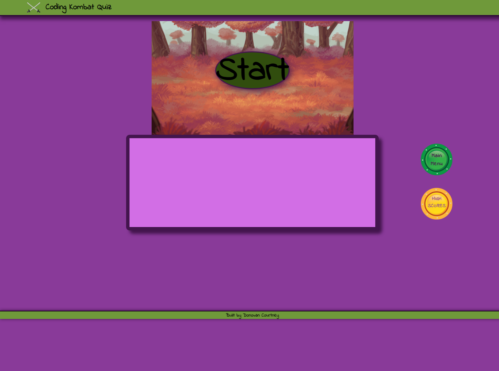

# Coding Kombat Quiz

## Description
The purpose of this project was the create a timed quiz and use Javascript to control adding, removing, and modifying html elements.
I attempted to add a bit more visual appeal and interaction than just presenting questions. I included an html canvas and scripted some spritesheets to animate based on the users selected answers. However, due to time contraints the combat portion of the quiz is purely aesthetics and hold no bearing on the users score.

Deployed Project: https://decourtney.github.io/coding-kombat-quiz/

 
    
  
          
    

 

## Installation

N/A

## Usage

The site loads to a Start screen and a main menu and high scores button - similar to retro games. Once the user clicks Start a character select screen and Ready button appear. The character select is non-functional. Clicking Ready will begin the quiz - once an answered is selected another question will display and continue to do so until the user runs out of time or questions. Upon Game Over the high scores screen will appear and the user will be able to enter their initials. Scores are saved to local storage.

## Credits

N/A

## License

MIT License

Copyright (c) 2022 decourtney

Permission is hereby granted, free of charge, to any person obtaining a copy
of this software and associated documentation files (the "Software"), to deal
in the Software without restriction, including without limitation the rights
to use, copy, modify, merge, publish, distribute, sublicense, and/or sell
copies of the Software, and to permit persons to whom the Software is
furnished to do so, subject to the following conditions:

The above copyright notice and this permission notice shall be included in all
copies or substantial portions of the Software.

THE SOFTWARE IS PROVIDED "AS IS", WITHOUT WARRANTY OF ANY KIND, EXPRESS OR
IMPLIED, INCLUDING BUT NOT LIMITED TO THE WARRANTIES OF MERCHANTABILITY,
FITNESS FOR A PARTICULAR PURPOSE AND NONINFRINGEMENT. IN NO EVENT SHALL THE
AUTHORS OR COPYRIGHT HOLDERS BE LIABLE FOR ANY CLAIM, DAMAGES OR OTHER
LIABILITY, WHETHER IN AN ACTION OF CONTRACT, TORT OR OTHERWISE, ARISING FROM,
OUT OF OR IN CONNECTION WITH THE SOFTWARE OR THE USE OR OTHER DEALINGS IN THE
SOFTWARE.